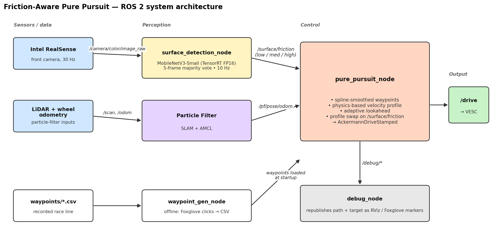
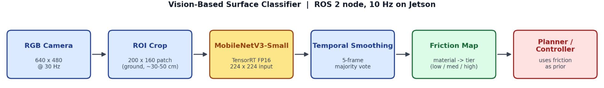

# Friction-Aware Autonomous Racing — Vision-Based Surface Classification

> Penn ESE 6150 (F1TENTH / RoboRacer) final project.

A predictive friction-adaptive racing stack for the RoboRacer / F1TENTH platform. A camera classifies the surface ahead of the car; a Pure Pursuit controller swaps to a pre-tuned profile so adaptation happens **before** the car loses traction, not after.

Full write-up: [`docs/ESE6150_Team3_Final_Project.pdf`](docs/ESE6150_Team3_Final_Project.pdf).

## Team Members

* **Ethan Sanchez** — etsa@upenn.edu (GitHub: [@etsa2103](https://github.com/etsa2103), Website: [ethansanchez.net](https://ethansanchez.net))
* **Avani Narula** — avnarula@upenn.edu (GitHub: [@avnarula](https://github.com/avnarula))
* **Yuntong Li** — li51@upenn.edu (GitHub: [@li51-AMX](https://github.com/li51-AMX))
* **Nandagopal Vidhu** — nvidhu@upenn.edu (GitHub: [@nvidhu-dev](https://github.com/nvidhu-dev))

## Demo Video

[](https://youtu.be/PTKwRxNZAGY)

Full project demo: **https://youtu.be/PTKwRxNZAGY**

### Detailed runs

| Carpet & ice rink | Multi-surface race track |
|:---:|:---:|
| [](https://youtu.be/ijghDgYKE5g) | [](https://youtu.be/TPjIcxFb8rk) |
| Bare ice with carpet patches dropped on top — the classifier sees the surface change and the controller slows on ice, speeds back up on carpet, without losing the line. | Tile + carpet + cloth + sticky-mat sections taped together — the same race line is driven across all four surfaces with profiles swapped in real time. |

---

## Problem, Motivation, and Contribution

**Problem.** Classical autonomous-racing controllers such as Pure Pursuit and Model Predictive Control typically assume a uniform road surface and a constant tire–road friction coefficient. In practice, vehicles frequently encounter abrupt transitions between surfaces with different traction properties. When such a transition occurs, the same steering and throttle commands produce different vehicle motion, leading to overshoot, understeer, and wheel slip. On the F1TENTH platform, whose light chassis is particularly sensitive to changes in traction, this manifests as inconsistent path tracking and occasional loss of control.

**Motivation.** This limitation is not unique to small-scale racing. Commercial autonomous vehicles must operate over rain, snow, ice, gravel, and wet pavement, each of which alters the available friction and requires a corresponding adjustment in driving behavior. Existing friction-estimation methods, including wheel-slip detection, inertial measurements, and observed-dynamics models, are inherently reactive: the vehicle must first experience degraded traction before the controller can adapt.

**Contribution.** A predictive, vision-based friction-aware racing pipeline that adapts the controller before the vehicle enters a new surface region. A forward-facing Intel RealSense camera captures images of the terrain ahead of the bumper, and a fine-tuned MobileNetV3-Small CNN classifies the upcoming surface in real time on the Jetson. The predicted surface class is mapped to a friction tier (`low`, `medium`, `high`) and published on a ROS 2 topic. A friction-aware Pure Pursuit controller subscribes to this topic and selects a corresponding parameter profile — maximum velocity, lateral and longitudinal acceleration limits, and lookahead bounds — hand-tuned for that surface. Evaluated on a mixed ice / carpet track and a four-surface lab track, the adaptive controller maintains stability on low-friction surfaces while preserving the higher speeds achievable on high-friction surfaces. Quantitative results are in the [Results](#results) section.

---

## Approach

1.  **Vision-based surface classification.** A MobileNetV3-Small CNN (ImageNet-pretrained, fine-tuned on 4 surfaces from 801 hand-collected ground-ROI patches) runs on the Jetson as a TensorRT FP16 engine, capped at 10 Hz. A fixed ground-ROI is cropped ~30–50 cm in front of the bumper from the 640 × 480 RealSense frame, classified, smoothed with a 5-frame majority vote, and the resulting friction tier (`low` / `medium` / `high`) is published on `/surface/friction`.
2.  **Friction-aware tuning profiles.** Three profiles live in [config/friction_profiles.yaml](src/f1_final_project/config/friction_profiles.yaml). Going from high to low friction the controller decreases min/max speed, max lateral acceleration, max longitudinal acceleration, and min/max lookahead. The Pure Pursuit helper transparently swaps each tuned parameter for its profile value, so the rest of the controller code never branches on friction. Lateral and longitudinal acceleration limits turned out to have the largest impact on per-surface tuning.
3.  **Curvature-aware lookahead.** On top of standard Pure Pursuit the lookahead distance is made a function of both speed *and* upcoming curvature: `Ld = (gain · v) / (1 + k_sensitivity · max_k_ahead)`, clipped to `[lookahead_min, lookahead_max]`. As speed increases the car looks further ahead for stability; when high curvature is detected ahead, the lookahead shrinks to follow the line tightly and reduce corner cutting.
4.  **Feasible velocity profile.** Per-waypoint target speeds are pre-computed along the smoothed spline from `v = sqrt(a_lat_max / k)`, then two forward/backward passes clip the profile against `max_lon_accel` so the car can actually decelerate to its corner-entry speeds. When `/surface/friction` changes, this profile is regenerated in place — no node restart, no separate waypoint file per surface.

Localization is provided by SLAM + a particle filter (`/pf/pose/odom`); the controller subscribes to the particle filter rather than raw odometry, so wheel slip on ice does not put the car at a phantom pose.

### Tuned Pure Pursuit parameters (ice vs. carpet)

| Parameter | Ice (low friction) | Carpet (high friction) |
|-----------|:--:|:--:|
| Max velocity | 1.8 | 4.0 |
| Min velocity | 0.5 | 1.5 |
| Max lateral acceleration | 1.5 | 4.0 |
| Max longitudinal acceleration | 1.0 | 2.2 |
| Turning gain | 1.0 | 1.5 |
| Lookahead gain | 1.5 | 1.5 |
| Lookahead min | 0.7 | 0.7 |
| Lookahead max | 2.5 | 2.5 |
| Lookahead window | 14 | 18 |

Speed caps and lateral/longitudinal acceleration limits do most of the work; the lookahead bounds barely move between profiles.

---

## System Architecture



*Figure 1: ROS 2 system architecture. `classifier_node` (from the `surface_classifier` package) publishes the friction tier on `/surface/friction`; the particle filter publishes pose on `/pf/pose/odom`; `pure_pursuit_node` consumes both, plus the waypoint CSV recorded by `waypoint_gen_node`, and emits the drive command on `/drive`. `debug_node` republishes the live race line and lookahead target as RViz / Foxglove markers.*

| Node | Package | Role |
|---|---|---|
| `waypoint_gen_node` | `f1_final_project` | Offline trajectory recorder. Clicks from Foxglove's `initialpose` tool are appended to a CSV under `src/f1_final_project/waypoints/`. |
| `classifier_node` | `surface_classifier` | Reads the front camera, crops the ground ROI, runs the MobileNetV3-Small TensorRT engine, applies a 5-frame majority vote, and publishes the friction tier on `/surface/friction` (plus `/surface/material`, `/surface/confidence`, `/surface/debug_image`) at 10 Hz. |
| `recorder_node` | `surface_classifier` | Saves labelled ROI patches to disk for retraining (used during data collection only, not in the live racing stack). |
| `pure_pursuit_node` | `f1_final_project` | Core controller. Subscribes to `/pf/pose/odom`, `/surface/friction`, and the waypoint CSV; recomputes its spline, velocity profile, and lookahead when a parameter or the friction tier changes; emits `AckermannDriveStamped` on `/drive`. A lower-latency C++ port lives in [pure_pursuit_node.cpp](src/f1_final_project/src/pure_pursuit_node.cpp). |
| `debug_node` | `f1_final_project` | Re-publishes the smoothed waypoint path and the active lookahead point as RViz / Foxglove markers. |
| `sensor_filtering_node` *(in development)* | `f1_final_project` | Designed to pre-filter LiDAR scans before they reach the particle filter; not fully integrated into the final stack. |
| `mpc_node` *(explored, not deployed)* | `f1_final_project` | Kinematic MPC over a 4-state model on the same `/surface/friction` interface. Did not track reliably in time; left in the repo as a starting point for future work. |

---

## Vision Pipeline



*Figure 2: Perception pipeline. The 640 × 480 RGB frame is cropped to a 200 × 160 ground ROI ~30–50 cm in front of the bumper, fed through MobileNetV3-Small (TensorRT FP16, 224 × 224 input), smoothed with a 5-frame majority vote, mapped from material label to friction tier, and published on `/surface/friction`.*

* **Temporal smoothing.** A 5-frame majority vote prevents a single noisy frame from flapping the controller between profiles. Friction-tier changes are correspondingly low-rate, which matches the timescale of actually rolling onto a new surface.
* **Profile swap, not parameter blend.** When the friction tier changes, the controller swaps to the matching profile in [friction_profiles.yaml](src/f1_final_project/config/friction_profiles.yaml) and regenerates the velocity profile along the spline in place — no node restart, no separate waypoint file per surface.
* **Manual override.** The controller's `friction_level` parameter accepts `0` (listen to `/surface/friction`, normal operation) or `1` / `2` / `3` to force low / medium / high while debugging on a known surface.

---

## Challenges and Solutions

* **Domain transfer of the classifier.** A model trained on one carpet shade misclassified an unseen carpet — the network had latched onto incidental colour and texture cues rather than the underlying material. Mitigated by widening the per-class training set across lighting and material variants so each label covers a broader visual distribution.
* **Boundary flicker.** When the cropped ground ROI straddled two materials at a transition, raw single-frame predictions oscillated between the two classes and would have caused the controller to flap between profiles. Mitigated with a 5-frame majority vote inside the classifier node, so a friction-tier change has to be supported by several consecutive frames before it propagates to the controller.
* **Per-surface controller tuning was tedious but unavoidable.** Each surface needed its own hand-tuned Pure Pursuit profile — max speed, lateral and longitudinal acceleration limits, lookahead bounds — and the tuning had to be done carefully on the actual surface to find the edge of stable behaviour. This is annoying in a research project, but it mirrors the workflow used in industry: production automotive controllers are likewise tuned and validated extensively across conditions. We accepted the cost for this submission and noted continuous friction-coefficient regression as the path to reduce it (see Future Work).
* **Generalizability of the classifier for a real-world deployment.** The current classifier is trained on a small, hand-collected dataset over four indoor surfaces under lab lighting. A production-grade version would need substantially more training data across surfaces, lighting, weather, and wear, plus an explicit low-confidence handling path — for example, falling back to the most conservative friction tier when the softmax confidence drops below a threshold instead of always committing to the top-1 class. The current pipeline always trusts its top prediction, which is acceptable for a controlled demo but not for an outdoor vehicle.

---

## Results

We ran two on-hardware experiments on the RoboRacer platform.

**Experiment 1 — Ice and Carpet (binary).** Half-ice / half-carpet track at the Class of 1923 ice rink. Each surface had its Pure Pursuit profile independently tuned first (see [Tuned Pure Pursuit parameters](#tuned-pure-pursuit-parameters-ice-vs-carpet)). The carpet-tuned controller used on the full mixed track lost traction and spun out on the ice section; the ice-tuned controller was stable but conservative. The vision-aware controller balanced both: stable on ice, fast on carpet.

**Experiment 2 — Tile, carpet, plastic cloth, sticky sheet.** Four-surface track in the lab with more frequent transitions. Per-surface profiles were tuned the same way; the adaptive controller produced visibly smoother surface transitions, fewer overshoots, and fewer spin-out events than any single-profile baseline.

### Controller outcomes on the mixed ice + carpet track

The most important result is qualitative, not a lap time: the **aggressive baseline can't finish a lap**. The carpet-tuned Pure Pursuit profile that gives the fastest single-surface lap is the one that spins out on the ice section every time, so it has no mixed-track lap time to report.

| Controller | Mixed-track outcome | Lap time |
|---|---|:--:|
| Aggressive baseline (carpet-tuned PP) | Spun out on ice; **did not complete a lap** | — |
| Conservative baseline (ice-tuned PP)  | Completed; slow on carpet | 13.0 s |
| Vision-aware adaptive PP              | Completed; fast on carpet, stable on ice | **10.8 s** |

For reference, on its own home surface the carpet-tuned controller laps the carpet-only track in roughly 7.8 s and the ice-tuned controller laps the ice-only track in roughly 13.0 s. The adaptive controller's 10.8 s mixed lap sits between these two single-surface times — exactly what we want from a lap that is half ice, half carpet. The headline finding is the contrast between rows 1 and 3: the friction-aware controller is the only one of the three that combines the aggressive baseline's high carpet speed with the conservative baseline's ability to keep the car on the track on ice.

### Classifier behavior

The classifier reliably distinguishes between visually distinct surfaces (ice, carpet, tile) under consistent lighting. The two failure modes:

* **Surface boundaries** — when the ROI straddles two materials the label flickers; temporal smoothing absorbs most of this.
* **Reflections on bare ice** — the ice rink picks up ceiling lights, which confuses the classifier.

Generalization to unseen surfaces is the obvious limit: a new carpet shade is enough to throw off the four-class model. The classifier also only picks the bucket — a parameter profile must still be hand-tuned per surface.

---

## Future Work

1.  **Continuous friction-coefficient prediction.** Future work will focus on developing a more automated friction estimation pipeline capable of directly predicting surface friction coefficients from camera images rather than classifying discrete terrain categories. This could allow controller parameters to be adjusted continuously without requiring manual tuning for each surface.

2.  **Classifier robustness and camera-based obstacle detection.** Additional improvements include increasing the robustness and generalization capability of the vision classifier across a wider variety of terrains and environmental conditions. We also plan to investigate integrating obstacle detection and avoidance using camera-based perception to identify hazards such as potholes or debris.

3.  **Model-based friction-aware control.** Future work could explore extending the system to model-based controllers such as Model Predictive Control (MPC), where friction estimates could dynamically modify cost function weights and vehicle constraints in real time.

---

## Build and Run

### Repository layout

This repo ships **two** ROS 2 packages, both under [`src/`](src/) for direct colcon use:

* [`src/f1_final_project/`](src/f1_final_project/) — `f1_final_project` (controller package). Pure Pursuit, debug node, waypoint generator, friction profiles.
* [`src/surface_classifier/`](src/surface_classifier/) — `surface_classifier` (perception package). RealSense → MobileNetV3-Small (TensorRT FP16) → `/surface/friction`.

The two packages communicate over the `/surface/friction` topic (`std_msgs/String`, values `low` / `medium` / `high`). The controller's `friction_callback` already subscribes to this exact topic, so no glue node is needed.

### Dependencies

* ROS 2 Humble
* RoboRacer Simulator or hardware interface
* Python (vision pipeline): `tensorrt` (ships with JetPack on the Jetson), `pycuda`, `opencv-python`, `cv_bridge`, `numpy`, `pyyaml`
* *Retraining only:* `torch`, `torchvision`, `onnx`

### Build

The repository is laid out as a standard colcon workspace — both packages live under `src/`, so you can clone and `colcon build` directly from the repo root:

```bash
git clone https://github.com/f1tenth-class/final-project-team3.git
cd final-project-team3
source /opt/ros/humble/setup.bash
colcon build --packages-select f1_final_project surface_classifier
source install/setup.bash
```

Before launching the classifier on hardware, edit `src/surface_classifier/config/classifier.yaml` so that `engine_path` and `friction_map_path` point at the actual locations on the deployed Jetson (the defaults assume `/home/nvidia/f1/f1tenth_ws/src/surface_classifier/...`).

### Run

1. **Bring up the Foxglove bridge and particle filter so the map appears in Foxglove.** Using the standard F1TENTH course packages:

   ```bash
   ros2 launch foxglove_bridge foxglove_bridge_launch.xml
   ros2 launch particle_filter localize_launch.py
   ```

   Substitute whichever particle-filter / localisation package your car ships with — the controller only needs an `Odometry` message on `/pf/pose/odom`.

2. **Record a race line** (one-time, per track):

   ```bash
   ros2 run f1_final_project waypoint_gen_node.py
   ```

   Use the `initialpose` clicker in Foxglove to drop waypoints along the desired line. Kill the node when done; the CSV is saved under `src/f1_final_project/waypoints/`.

3. **Launch the friction-aware racing stack** (one terminal each):

   ```bash
   ros2 launch surface_classifier classifier.launch.py
   ros2 run    f1_final_project   pure_pursuit_node.py
   ros2 run    f1_final_project   debug_node.py
   ```

   The classifier publishes the friction tier on `/surface/friction` at 10 Hz. The controller's `friction_level` parameter:
   * `0` — listen to `/surface/friction` (normal operation)
   * `1` / `2` / `3` — force low / medium / high while debugging on a known surface

4. Open Foxglove for the live visualization, and set the `waypoint_file` parameter on the running controller to load your recorded race line.
